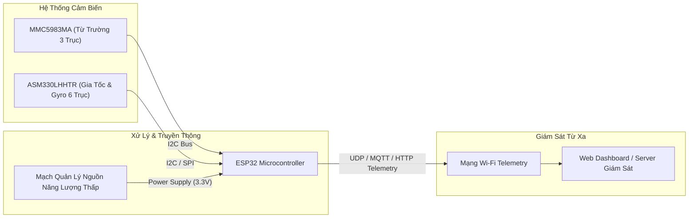

# 🧭 Cảm Biến Từ Trường & Gia Tốc Đo Xa Không Dây (Low-Power Wireless Magnetic & Acceleration Sensing System)


Dự án thiết kế hệ thống phần cứng và phần mềm nhúng (Embedded IoT System) công suất thấp dùng để đo đạc, thu thập dữ liệu **Từ Trường 3 Trục** và **Gia Tốc / Góc Quay 6 Trục**, truyền dữ liệu đo từ xa qua mạng không dây **Wi-Fi Telemetry** về máy chủ giám sát.

---

## ⚡ Tính Năng Hệ Thống (Key Features)

- **Cảm Biến Từ Trường Độ Chính Xác Cao:** Tích hợp chip **MMC5983MA** (3-Axis Magnetometer) đo từ trường trái đất và phát hiện các biến đổi từ tính nhạy bén.
- **Cảm Biến Gia Tốc & Góc Quay Chuẩn Ô Tô:** Tích hợp IMU 6 trục **ASM330LHHTR** (Automotive Grade 6-axis IMU) đo gia tốc tuyến tính và vận tốc góc cực kỳ ổn định.
- **Khóa Mạch Công Suất Thấp (Low-Power Design):** Quản lý nguồn thông minh tối ưu điện năng tiêu thụ cho các thiết bị đo đạc chạy pin / năng lượng mặt trời.
- **Truyền Dữ Liệu Không Dây (Wi-Fi Telemetry):** Vi điều khiển **ESP32** đóng vai trò thu thập dữ liệu qua chuẩn truyền thông **I2C/SPI** và phát dữ liệu Telemetry liên tục qua Wi-Fi.

---

## 🧩 Sơ Đồ Khối Hệ Thống (System Architecture)



---

## 📊 Thông Số Kỹ Thuật (Specifications)

| Thông Số (Parameter) | Giá Trị (Value) | Ghi Chú (Notes) |
| :--- | :--- | :--- |
| **Vi Điều Khiển Main MCU** | `ESP32 / ESP32-WROOM-32` | Tích hợp Wi-Fi 802.11 b/g/n & Bluetooth |
| **Cảm Biến Từ Trường** | `MMC5983MA` | 0.5 mG resolution, ±8 Gauss FSR |
| **Cảm Biến IMU 6 Trục** | `ASM330LHHTR` | 3-axis Accel + 3-axis Gyro (Automotive) |
| **Chuẩn Truyền Thông Nối Tiếp** | `I2C (400kHz Fast Mode) / SPI` | Giao tiếp độ tin cậy cao |
| **Điện Áp Cấp (VCC)** | `3.3V DC` | Tích hợp LDO điện áp thấp |
| **Phần Mềm EDA Thiết Kế PCB** | `KiCad v6 / v7 / v8` | Sẵn file `.kicad_sch` & `.kicad_pcb` |

---

## 📂 Cấu Trúc Thư Mục Dự Án (Repository Structure)

```text
Magnetic_field_&_Acceleration_Sensors/
├── hardware/                         # Thiết kế phần cứng (Hardware EDA)
│   ├── schematics/                   # File bản vẽ sơ đồ nguyên lý PDF
│   │   └── schematic_Qcomment_24_12_25.pdf
│   ├── kicad/                        # Bộ file nguồn KiCad (.kicad_sch, .kicad_pcb, .kicad_pro)
│   │   ├── Low-Power Instrument.kicad_pcb
│   │   ├── Low-Power Instrument.kicad_sch
│   │   └── production/               # File Gerber gia công PCB, BOM, CPL
│   └── Dependencies/                 # Thư viện footprint & 3D STEP linh kiện
│       ├── ul_MMC5983MA/             # 3D Model & Footprints cảm biến từ trường
│       └── ul_ASM330LHHTR/           # 3D Model & Footprints cảm biến gia tốc
├── firmware/                         # Mã nguồn vi điều khiển kép (Dual MCU)
│   ├── stm32_firmware/               # Mã nguồn STM32L4xx HAL đọc mẫu cảm biến I2C/UART
│   │   ├── Core/Src/main.c           # Chương trình chính xử lý mẫu từ trường & IMU
│   │   └── supercap_test.ioc         # File cấu hình chân STM32CubeMX
│   └── esp32_wifi_telemetry/         # Mã nguồn ESP32 Arduino IDE
│       └── esp32_wifi_telemetry.ino  # Code Server Web 3D Dashboard & WebSocket Telemetry
├── docs/                             # Tài liệu kỹ thuật dự án
├── .gitignore                        # Cấu hình lọc file rác KiCad & IDE
├── LICENSE                           # Giấy phép bản quyền nguồn mở MIT
└── README.md                         # Tài liệu giới thiệu dự án
```

---

## 🛠️ Hướng Dẫn Cài Đặt & Nạp Code (Installation & Flashing Guide)

### 1. Mở & Chỉnh Sửa Phần Cứng (KiCad)
1. Cài đặt phần mềm [KiCad EDA v6+](https://www.kicad.org/).
2. Mở file `hardware/kicad/Low-Power Instrument.kicad_pro` để xem sơ đồ nguyên lý và thiết kế mạch PCB 2 lớp.

### 2. Nạp Code Cho Vi Điều Khiển ESP32
1. Mở phần mềm **Arduino IDE** (hoặc VS Code với PlatformIO).
2. Thêm bo mạch ESP32 và mở file `firmware/esp32_wifi_telemetry/esp32_wifi_telemetry.ino`.
3. Cấu hình thông số Wi-Fi (SSID, Password) và bấm **Upload** để nạp code cho ESP32.

---

## 📜 Giấy Phép (License)

Dự án được phân phối dưới giấy phép [MIT License](LICENSE) - Miễn phí sử dụng, nghiên cứu và phát triển sản phẩm thương mại.

---
*Authored by **Viet Hoang Luong**.*
